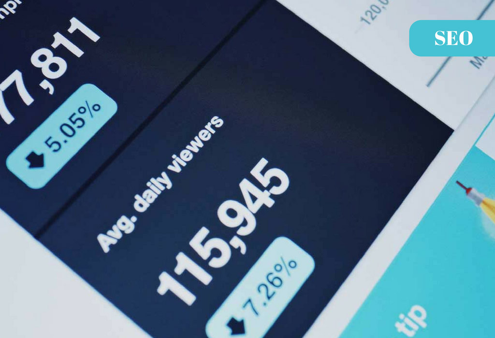

<!-- Main -->

<!-- One -->
<section id="one">
	

		<header class="major">
			<h2>What I believe</h2>
		</header>
		
The world will never stop evolving and continue to enhance the quality of our lifestyle in various ways. It is our duty to make it a better place by offering our utmost services to the local communities. We all have responsibilities to make it a better place for our next generations. If you are non-profit organizations, I am happy to help you to deliver clear messages to your local communities. Be it content writing, web design, social media ad, etc. Everyone can help and everyone can benefit from each other. Just contact me and we shall discuss more. I love Sandakan!

	

</section>

<!-- Two -->
<section id="two" class="spotlights">
	<section>
		
		

			

				<header class="major">
					<h3>Web Design</h3>
				</header>
				
I have experienced in a few projects and one of the ongoing project is <strong>"The Church of Good Shepherd(COGS)"</strong> in Sandakan. You may click the <strong>COGS Project</strong> below to have a look. Feel free to give me your honest feedback as I am eager to learn and contribute back to the society. Cheers!

				<ul class="actions">
					<li><a href="www.cogssandakan.com" class="button" target="_blank">COGS Project</a></li>
				</ul>
			

		

	</section>
	<section>
		
		

			

				<header class="major">
					<h3>Digital Marketing & Communications</h3>
				</header>
				
If you want to be seen as a <strong>leader</strong> in your industries, how can you do it in the digital world? One of the famous techniques is by giving <strong>free and valuable advices/content</strong> to your visitors, or better be known as a blog. Beside blog, you can also do content in different formats such as, video, podcast, infographic, etc. You may want to go to <strong>"Promo Video"</strong> below which I produced during the launching of COGS Website. Cheers!

				<ul class="actions">
					<li><a href="https://www.youtube.com/watch?v=0bExjOkPI0w" class="button" target="_blank">Promo Video</a></li>
				</ul>
			

		

	</section>
	<section>
		
		

			

				<header class="major">
					<h3>Local SEO</h3>
				</header>
				
If you want to be <strong>found</strong> on google, yahoo, etc., you are in the right place. SEO is a specialize skill that helps your brand <strong>stand out</strong> from your competitors. Rank your website based on your keywords. Do it right and you can gain more attention from your audience just like a radio broadcast. Thousand listens to your channel and receive the latest news, promotions and offer from you. Click <strong>"SEO Explained"</strong> below to gain more understanding of SEO. Cheers!

				<ul class="actions">
					<li><a href="https://www.youtube.com/watch?v=hF515-0Tduk" class="button" target="_blank">SEO Explained</a></li>
				</ul>
			

		

	</section>
</section>

<!-- Three -->
<section id="three">
	

		<header class="major">
			<h2>Branding</h2>
		</header>
		
Branding is about what your audience thinks about you, not what you think. Strategies and position yourself right and continue to collect feedback from your audience. You may be surprised by their answers and need to rethink your strategies. If you want to know more, click <strong>"Portfolio"</strong> below to find out more. Cheers!

		<ul class="actions">
			<li><a href="portfolio.html" class="button next">Portfolio</a></li>
		</ul>
	

</section>

